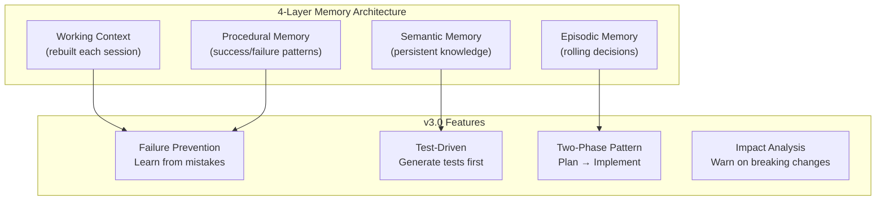

# Claude Code Long-Running Agent Harness

A Claude Code plugin for automated, context-preserving coding sessions with **4-layer memory architecture**, failure prevention, test-driven features, GitHub integration, and multi-agent orchestration.

Based on [Anthropic's engineering article](https://www.anthropic.com/engineering/effective-harnesses-for-long-running-agents) and enhanced with patterns from:
- [Context-Engine](https://github.com/zeddy89/Context-Engine) - Memory architecture
- [Agent-Foreman](https://github.com/mylukin/agent-foreman) - Task management patterns
- [Autonomous-Coding](https://github.com/anthropics/claude-quickstarts/tree/main/autonomous-coding) - Test-driven approach

## TL;DR - What's New in v3.0



## Quick Start

```bash
# Install plugin
claude plugin install claude-harness github:panayiotism/claude-harness

# In your project
claude
/claude-harness:setup

# Add a feature (generates tests first!)
/claude-harness:feature Add user authentication

# Plan before implementing
/claude-harness:plan-feature feature-001

# Implement until all tests pass
/claude-harness:implement feature-001

# Save progress + persist memory
/claude-harness:checkpoint
```

## Session Start Hook

When you start Claude Code in a harness-enabled project:

```
┌─────────────────────────────────────────────────────────────────┐
│                  CLAUDE HARNESS v3.0.0 (Memory Architecture)     │
├─────────────────────────────────────────────────────────────────┤
│  P:2 WIP:1 Tests:1 | Active: feature-001                        │
│  Memory: 12 decisions | 3 failures | 8 successes                │
├─────────────────────────────────────────────────────────────────┤
│  Commands:                                                      │
│  /claude-harness:start        Compile context + GitHub sync     │
│  /claude-harness:feature      Add feature (test-driven)         │
│  /claude-harness:plan-feature Plan before implementation        │
│  /claude-harness:implement    Start agentic loop                │
│  /claude-harness:checkpoint   Commit + persist memory           │
└─────────────────────────────────────────────────────────────────┘
```

Shows:
- **Feature status**: Pending / Work-in-progress / Needs tests
- **Memory stats**: Decisions recorded, failures to avoid, successes to reuse
- **Failure prevention**: If failures exist, warns before implementing

## v3.0 Memory Architecture

### Four Layers

```
.claude-harness/memory/
├── working/context.json      # Rebuilt each session (computed)
├── episodic/decisions.json   # Rolling window of recent decisions
├── semantic/                 # Persistent project knowledge
│   ├── architecture.json
│   ├── entities.json
│   └── constraints.json
└── procedural/               # Success/failure patterns (append-only)
    ├── failures.json
    ├── successes.json
    └── patterns.json
```

| Layer | Purpose | Lifecycle |
|-------|---------|-----------|
| **Working** | Current task only | Rebuilt each session |
| **Episodic** | Recent decisions, context | Rolling window (50 max) |
| **Semantic** | Project architecture, patterns | Persistent |
| **Procedural** | What worked, what failed | Append-only |

### Context Compilation

Each session compiles **fresh working context** by pulling relevant information from memory layers:

```
/claude-harness:start

→ Compile working context:
  • Pull recent decisions from episodic (last 10 relevant)
  • Pull project patterns from semantic
  • Pull failures to avoid from procedural
  • Pull successful approaches from procedural

→ Result: Clean, relevant context without accumulation
```

## Failure Prevention System

Never repeat the same mistakes. When you try an approach that fails, it's recorded:

```json
// .claude-harness/memory/procedural/failures.json
{
  "entries": [
    {
      "id": "uuid",
      "timestamp": "2025-01-20T10:30:00Z",
      "feature": "feature-001",
      "approach": "Used direct DOM manipulation for state",
      "files": ["src/components/Auth.tsx"],
      "errors": ["React hydration mismatch"],
      "rootCause": "SSR incompatibility with direct DOM access",
      "prevention": "Use useState and useEffect instead"
    }
  ]
}
```

Before each implementation attempt:

```
/claude-harness:implement feature-002

⚠️  SIMILAR APPROACH FAILED BEFORE

Failure: Used direct DOM manipulation for state
When: 2025-01-20
Files: src/components/Auth.tsx
Error: React hydration mismatch
Root Cause: SSR incompatibility with direct DOM access

Prevention Tip: Use useState and useEffect instead

✅ SUCCESSFUL ALTERNATIVE
Approach: React hooks with conditional rendering
Files: src/components/User.tsx
Why it worked: Proper SSR hydration
```

### Check Your Approach

```
/claude-harness:check-approach "I plan to use localStorage for auth state"

→ Checks procedural/failures.json for similar approaches
→ Checks procedural/successes.json for alternatives
→ Reports matches and recommendations
```

## Test-Driven Features

Features now generate tests **before** implementation:

```
/claude-harness:feature Add user authentication

→ Creates feature entry with status: "pending"
→ Creates GitHub issue (if MCP configured)
→ Creates feature branch
→ Recommends: Run /claude-harness:generate-tests feature-001
```

```
/claude-harness:generate-tests feature-001

→ Reads feature description
→ Analyzes project test patterns from semantic memory
→ Generates test cases:
  • Unit tests for core functionality
  • Integration tests for API/database
  • Edge cases and error handling
→ Creates test files (they FAIL initially - no implementation yet)
→ Updates feature: status = "needs_implementation"
```

### Test Cases Schema

```json
// .claude-harness/features/tests/feature-001.json
{
  "featureId": "feature-001",
  "generatedAt": "2025-01-20T10:30:00Z",
  "framework": "jest",
  "cases": [
    {
      "id": "test-001",
      "type": "unit",
      "description": "Should authenticate user with valid credentials",
      "file": "tests/auth/login.test.ts",
      "status": "pending",
      "code": "test('authenticates with valid credentials', async () => {...})"
    }
  ],
  "coverage": {
    "target": 80,
    "current": 0
  }
}
```

## Two-Phase Pattern

Separate planning from implementation:

### Phase 1: Plan

```
/claude-harness:plan-feature feature-001

→ Analyzes requirements
→ Identifies files to create/modify
→ Runs impact analysis
→ Checks failure patterns
→ Generates tests (if not done)
→ Creates implementation plan
```

Output:
```
Implementation Plan for feature-001:

Steps:
1. Create auth service (src/services/auth.ts)
2. Add login API route (src/app/api/auth/login/route.ts)
3. Create login form component (src/components/LoginForm.tsx)
4. Add protected route wrapper (src/components/ProtectedRoute.tsx)

Impact Analysis:
- High: src/app/layout.tsx (15 dependents)
- Medium: src/lib/api.ts (8 dependents)

Failures to Avoid:
- Don't use direct DOM manipulation (failed in feature-003)

Successful Patterns to Use:
- React hooks with conditional rendering
- Server-side session validation
```

### Phase 2: Implement

```
/claude-harness:implement feature-001

→ Loads loop state (resume if active)
→ Checks failure patterns before each attempt
→ Verifies tests are generated
→ Implements to pass tests
→ Runs ALL verification commands
→ Records success/failure to procedural memory
```

## Commands Reference

| Command | Purpose |
|---------|---------|
| `/claude-harness:setup` | Initialize harness with v3.0 structure |
| `/claude-harness:start` | Compile context + GitHub sync + status |
| `/claude-harness:feature <desc>` | Add feature (test-driven) |
| `/claude-harness:generate-tests <id>` | Generate test cases before implementation |
| `/claude-harness:plan-feature <id>` | Plan implementation (Phase 1) |
| `/claude-harness:check-approach <desc>` | Check if approach matches past failures |
| `/claude-harness:implement <id>` | Agentic loop until tests pass (Phase 2) |
| `/claude-harness:orchestrate <id>` | Spawn multi-agent team |
| `/claude-harness:checkpoint` | Commit + persist memory + create/update PR |
| `/claude-harness:merge-all` | Merge PRs, close issues, archive features |

## v3.0 Directory Structure

```
.claude-harness/
├── memory/
│   ├── working/
│   │   └── context.json          # Rebuilt each session
│   ├── episodic/
│   │   └── decisions.json        # Rolling window (50 max)
│   ├── semantic/
│   │   ├── architecture.json     # Project structure
│   │   ├── entities.json         # Key components
│   │   └── constraints.json      # Rules & conventions
│   └── procedural/
│       ├── failures.json         # Append-only failure log
│       ├── successes.json        # Append-only success log
│       └── patterns.json         # Learned patterns
├── impact/
│   ├── dependency-graph.json     # File dependencies
│   └── change-log.json           # Recent changes
├── features/
│   ├── active.json               # Current features
│   ├── archive.json              # Completed features
│   └── tests/
│       └── {feature-id}.json     # Test cases per feature
├── agents/
│   ├── context.json              # Orchestration state
│   └── handoffs.json             # Agent handoff queue
├── loops/
│   └── state.json                # Agentic loop state
├── config.json                   # Plugin configuration
└── claude-progress.json          # Session summary
```

## Feature Schema (v3.0)

```json
{
  "id": "feature-001",
  "name": "User Authentication",
  "description": "Add login/logout with session management",
  "priority": 1,
  "status": "pending|needs_tests|in_progress|passing|failing|blocked|escalated",
  "phase": "planning|test_generation|implementation|verification",
  "tests": {
    "generated": true,
    "file": "features/tests/feature-001.json",
    "passing": 0,
    "total": 15
  },
  "verification": {
    "build": "npm run build",
    "tests": "npm run test",
    "lint": "npm run lint",
    "typecheck": "npx tsc --noEmit",
    "custom": []
  },
  "attempts": 0,
  "maxAttempts": 10,
  "relatedFiles": [],
  "github": {
    "issueNumber": 42,
    "prNumber": null,
    "branch": "feature/feature-001"
  },
  "createdAt": "2025-01-20T10:30:00Z",
  "updatedAt": "2025-01-20T10:30:00Z"
}
```

## Agentic Loops

Autonomous implementation loops that continue until ALL tests pass:

```
/claude-harness:implement feature-001

┌─────────────────────────────────────────────────────────────────┐
│  AGENTIC LOOP: User Authentication                              │
├─────────────────────────────────────────────────────────────────┤
│  Attempt 3/10                                                   │
│  ├─ Failure Prevention: Checked 3 past failures                 │
│  ├─ Implementation: Using React hooks pattern                   │
│  ├─ Verification:                                               │
│  │   ├─ Build:     ✅ PASSED                                    │
│  │   ├─ Tests:     ✅ PASSED (15/15)                            │
│  │   ├─ Lint:      ✅ PASSED                                    │
│  │   └─ Typecheck: ✅ PASSED                                    │
│  └─ Result: ✅ SUCCESS                                          │
├─────────────────────────────────────────────────────────────────┤
│  ✅ Feature complete! Approach saved to successes.json          │
└─────────────────────────────────────────────────────────────────┘
```

On failure:
- Records approach to `failures.json` with root cause analysis
- Analyzes errors and tries different approach
- Consults `successes.json` for working patterns
- Up to 10 attempts before escalation

## Multi-Agent Orchestration

For complex features, spawn specialized agents:

```
/claude-harness:orchestrate feature-001

→ Phase 1: Task Analysis
  - Identifies domains: frontend, backend, database
  - Checks impact analysis

→ Phase 2: Failure Prevention Check
  - Queries procedural/failures.json
  - Warns agents about approaches to avoid

→ Phase 3: Agent Selection
  - react-specialist (frontend components)
  - backend-developer (API routes)
  - database-administrator (schema)
  - code-reviewer (mandatory)

→ Phase 4: Parallel Execution
  - Independent tasks run simultaneously
  - Handoffs managed via agents/handoffs.json

→ Phase 5: Verification Loop
  - All commands must pass
  - Re-spawns agents on failure (max 3 cycles)

→ Phase 6: Memory Persistence
  - Records successes/failures
  - Updates patterns
```

## Impact Analysis

Track how changes affect other components:

```json
// .claude-harness/impact/dependency-graph.json
{
  "nodes": {
    "src/lib/auth.ts": {
      "imports": ["src/lib/api.ts", "src/types/user.ts"],
      "importedBy": ["src/app/api/auth/login/route.ts", "src/components/LoginForm.tsx"],
      "tests": ["tests/lib/auth.test.ts"],
      "type": "module"
    }
  },
  "hotspots": ["src/lib/api.ts"],
  "criticalPaths": ["src/app/layout.tsx"]
}
```

When modifying files:
- Identifies dependent files
- Warns about high-impact changes
- Suggests running related tests

## Migration from v2.x

```bash
# In your project with existing harness
./setup.sh --migrate

# Creates backup: .claude-harness-backup-{timestamp}/
# Migrates:
#   feature-list.json → features/active.json
#   agent-memory.json → memory/procedural/
#   working-context.json → memory/working/context.json
#   loop-state.json → loops/state.json
```

Or let it auto-migrate on first run of a harness command.

## GitHub MCP Integration

```bash
# Setup
claude mcp add github -s user

# Workflow
/claude-harness:feature Add dark mode   # Creates issue + branch
/claude-harness:implement feature-001   # Implements until tests pass
/claude-harness:checkpoint              # Commits, pushes, creates PR
/claude-harness:merge-all               # Merges PRs in dependency order
```

## Configuration

```json
// .claude-harness/config.json
{
  "version": 3,
  "verification": {
    "build": "npm run build",
    "tests": "npm run test",
    "lint": "npm run lint",
    "typecheck": "npx tsc --noEmit"
  },
  "memory": {
    "episodicMaxEntries": 50,
    "contextCompilationEnabled": true
  },
  "failurePrevention": {
    "enabled": true,
    "similarityThreshold": 0.7
  },
  "impactAnalysis": {
    "enabled": true,
    "warnOnHighImpact": true
  },
  "testDriven": {
    "enabled": true,
    "generateTestsBeforeImplementation": true
  }
}
```

## Changelog

| Version | Changes |
|---------|---------|
| **3.0.0** | **Memory Architecture Release**: 4-layer memory system (Working/Episodic/Semantic/Procedural), failure prevention system, test-driven features with `/generate-tests`, two-phase pattern with `/plan-feature`, impact analysis, computed context compilation, new directory structure, v2.x migration support |
| 2.6.0 | Agentic Loops: `/implement` runs until verification passes |
| 2.5.1 | Full command paths in session output |
| 2.5.0 | Box-drawn UI in session start |
| 2.4.0 | Fixed hooks loading |
| 2.3.0 | SessionStart hook, auto-setup detection |
| 2.2.0 | Moved files to `.claude-harness/` |
| 2.1.0 | Added `working-context.json` |
| 2.0.0 | Shortened command names |
| 1.1.0 | Multi-agent orchestration |
| 1.0.0 | Initial release |

## Key Principles

1. **Never Trust Self-Assessment** - All verification is mandatory via commands
2. **Learn From Mistakes** - Failure prevention system records and warns
3. **Test First** - Generate tests before implementation
4. **Computed Context** - Fresh, relevant context each session (no accumulation)
5. **Memory Persistence** - Knowledge survives context windows
6. **Single Feature Focus** - One feature at a time prevents scope creep

## Sources

- [Anthropic: Effective Harnesses for Long-Running Agents](https://www.anthropic.com/engineering/effective-harnesses-for-long-running-agents)
- [Context-Engine](https://github.com/zeddy89/Context-Engine) - Memory architecture inspiration
- [Agent-Foreman](https://github.com/mylukin/agent-foreman) - Task management patterns
- [Autonomous-Coding](https://github.com/anthropics/claude-quickstarts/tree/main/autonomous-coding) - Test-driven approach
