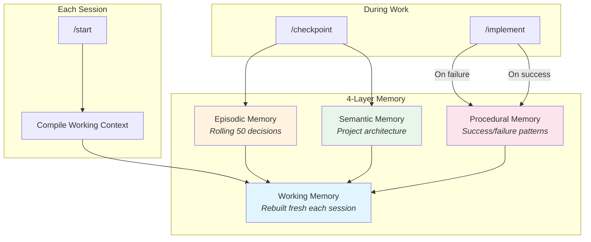
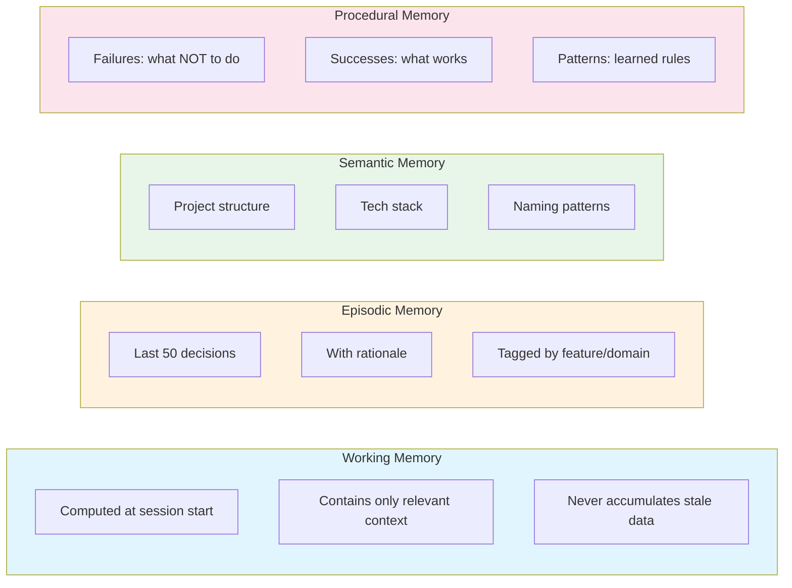
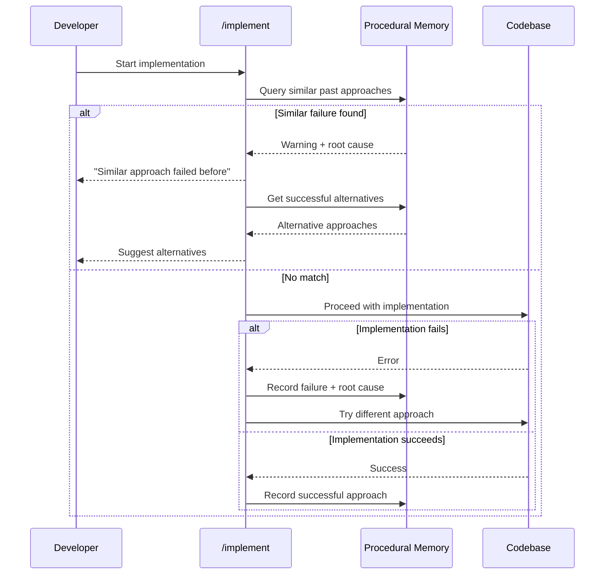
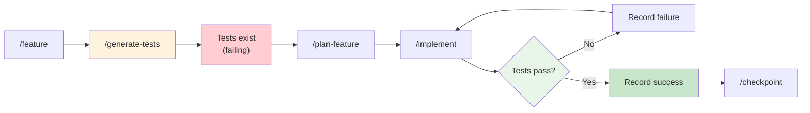
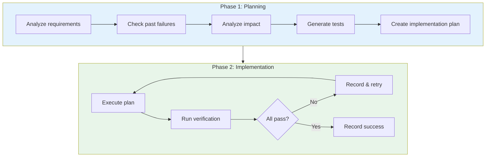
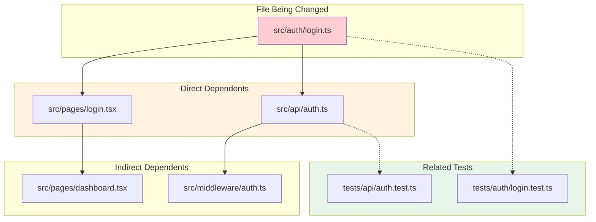
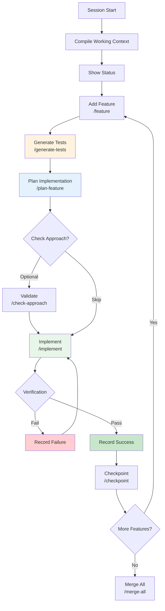

# Release Notes: v3.0.0 - Memory Architecture

**Release Date**: January 2026
**Codename**: Memory Architecture Release

---

## Overview

Major release transforming claude-harness into an intelligent, learning agent harness with a 4-layer memory architecture. The agent now remembers what works, avoids past mistakes, and builds context that's always fresh and relevant.

### Inspiration

This release combines the best patterns from three pioneering projects:

| Project | What We Borrowed |
|---------|------------------|
| [Context-Engine](https://github.com/zeddy89/Context-Engine) | 4-layer memory architecture, computed context |
| [Agent-Foreman](https://github.com/mylukin/agent-foreman) | Granular status states, impact analysis |
| [Autonomous-Coding](https://github.com/anthropics/claude-quickstarts/tree/main/autonomous-coding) | Test-driven features, two-phase pattern |

---

## Architecture

### Memory System Overview



### Memory Layer Details



---

## Failure Prevention System

The harness now learns from mistakes and prevents repeating them.



### What Gets Recorded

**On Failure:**
```json
{
  "approach": "Used localStorage for JWT tokens",
  "files": ["src/auth/token.ts"],
  "error": "Tokens exposed to XSS attacks",
  "rootCause": "localStorage accessible from any script",
  "prevention": "Use httpOnly cookies instead"
}
```

**On Success:**
```json
{
  "approach": "Used httpOnly cookies for JWT tokens",
  "files": ["src/auth/token.ts", "src/api/middleware.ts"],
  "rationale": "Secure, not accessible from JavaScript",
  "reusableFor": ["authentication", "session management"]
}
```

---

## Test-Driven Features

Features now generate tests BEFORE implementation.



### Benefits

1. **Clear acceptance criteria** - Tests define "done"
2. **No false completions** - Can't mark done if tests fail
3. **Regression prevention** - Tests catch future breaks
4. **Documentation** - Tests show intended behavior

---

## Two-Phase Pattern

Separate planning from implementation for better outcomes.



### Commands

| Phase | Command | Purpose |
|-------|---------|---------|
| 1 | `/plan-feature` | Analyze, check failures, create plan |
| 2 | `/implement` | Execute with verification loop |

---

## Impact Analysis

Track file dependencies to prevent breaking changes.



### Impact Scoring

| Score | Dependents | Action |
|-------|------------|--------|
| Low | 0-2 | Proceed normally |
| Medium | 3-5 | Run related tests |
| High | 6+ | Full test suite, careful review |

---

## New Commands

### `/claude-harness:generate-tests`

Generate test cases BEFORE implementation.

```
/claude-harness:generate-tests feature-001
```

**Output:**
- Test specification in `.claude-harness/features/tests/feature-001.json`
- Actual test files in project's test directory
- Tests initially FAIL (expected - no implementation yet)

### `/claude-harness:plan-feature`

Plan implementation with full context.

```
/claude-harness:plan-feature feature-001
```

**Checks:**
- Past failures for similar approaches
- Impact analysis for files to modify
- Dependencies on other features
- Test coverage requirements

### `/claude-harness:check-approach`

Validate an approach before implementing.

```
/claude-harness:check-approach "Store user session in Redis"
```

**Returns:**
- Similar past failures (if any)
- Successful alternatives
- Recommendation to proceed or reconsider

---

## New Directory Structure

```
.claude-harness/
├── memory/
│   ├── working/
│   │   └── context.json          # Rebuilt each session
│   ├── episodic/
│   │   └── decisions.json        # Rolling 50 decisions
│   ├── semantic/
│   │   ├── architecture.json     # Project structure
│   │   ├── entities.json         # Key components
│   │   └── constraints.json      # Project rules
│   └── procedural/
│       ├── failures.json         # What NOT to do
│       ├── successes.json        # What works
│       └── patterns.json         # Learned patterns
├── features/
│   ├── active.json               # Current features
│   └── tests/
│       └── {feature-id}.json     # Test specifications
├── impact/
│   └── dependency-graph.json     # File relationships
├── agents/
│   └── context.json              # Orchestration state
├── loops/
│   └── state.json                # Agentic loop state
├── feature-list.json             # (v2.x backward compat)
├── feature-archive.json          # Completed features
└── claude-progress.json          # Session continuity
```

---

## Complete Workflow



---

## Migration from v2.x

### Automatic Migration

Run `/claude-harness:setup` in your project. It automatically:

1. Detects v2.x structure (no `memory/` directory)
2. Creates new directory structure
3. Migrates existing files:
   - `agent-memory.json` → `memory/procedural/`
   - `working-context.json` → `memory/working/context.json`
   - `agent-context.json` → `agents/context.json`
   - `loop-state.json` → `loops/state.json`
4. Preserves backward-compatible files:
   - `feature-list.json` (still works)
   - `feature-archive.json`
   - `claude-progress.json`
5. Creates `.migrated-from-v2` marker

### What Stays the Same

- All existing commands work unchanged
- Feature tracking format compatible
- GitHub integration unchanged
- Agentic loops work as before

### What's New

- Memory persists across sessions
- Failures prevent repeat mistakes
- Tests generated before coding
- Impact analysis warns of breaking changes

---

## Breaking Changes

**None.**

v2.x projects are automatically migrated with full backward compatibility.

---

## Upgrade Instructions

```bash
# 1. Pull latest plugin version
cd ~/.claude/plugins/claude-harness
git pull origin main

# 2. In your project
cd your-project
claude

# 3. Run setup (auto-detects and migrates)
/claude-harness:setup

# 4. Start using new features
/claude-harness:start
```

---

## Credits

- **Context-Engine** by [@zeddy89](https://github.com/zeddy89) - Memory architecture concept
- **Agent-Foreman** by [@mylukin](https://github.com/mylukin) - Impact analysis patterns
- **Autonomous-Coding** by [Anthropic](https://github.com/anthropics) - Test-driven approach
- **Anthropic Engineering** - [Effective Harnesses article](https://www.anthropic.com/engineering/effective-harnesses-for-long-running-agents)

---

## What's Next

Future releases may include:
- Automatic dependency graph generation
- Cross-project memory sharing
- Performance metrics and optimization suggestions
- Integration with external test runners
